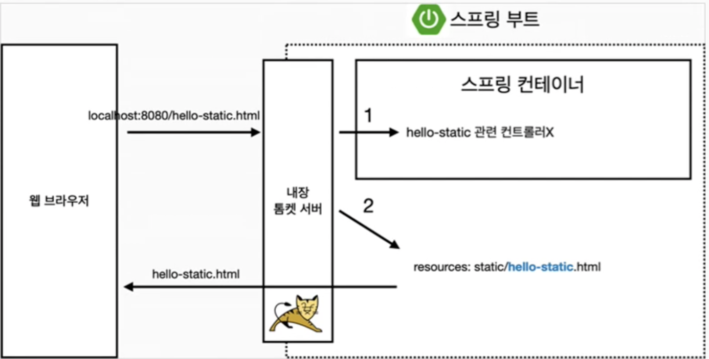
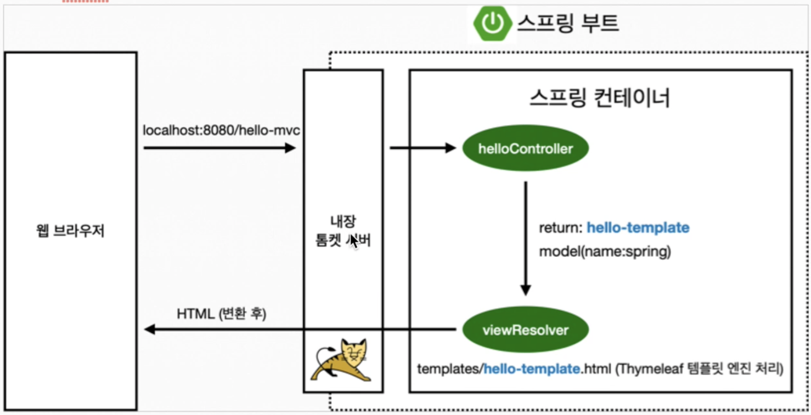
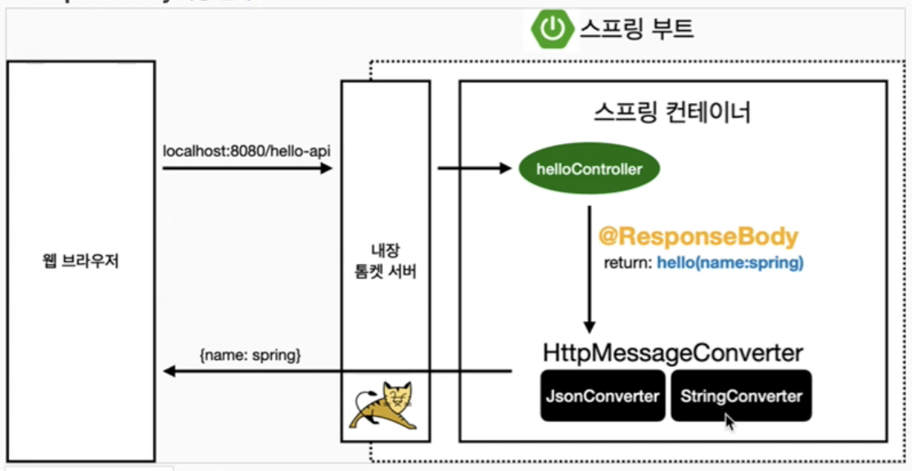

#### 최초 작성일 : 2021.05.09(일)

# 스프링 프레임워크 입문

Spring Boot를 이용한 DI/IoC, Web MVC, DB 접근 기술에 대한 학습을 진행한다.

## 학습 환경

1. OS : MacOS
2. JDK : OpenJDK 11.0.5
3. Framework : Spring Boot 2.4.5
    - [Spring Initializer 링크 : https://start.spring.io](https://start.spring.io)
    - 의존설정(Dependencies)
        - Spring Web
        - Thymeleaf View Template
4. Build Tools : Gradle
5. Database : H2

## View 환경설정

1. 스프링 부트가 제공하는 Welcome Page 기능
    - Spring Boot는 정적 및 템플릿 환영 페이지를 모두 지원한다. 먼저 구성된 정적 콘텐츠 위치에서 index.html 파일을 찾고, 없는 경우 인덱스 템플릿을 찾는다. 둘 중 하나가 있으면 자동으로
      응용 프로그램의 시작 페이지로 사용된다.
2. Thymeleaf 템플릿 엔진 동작 확인
   
    - 실행 : http://localhost:8080/hello
    - 컨트롤러에서 리턴 값으로 문자열을 반환하면 `뷰 리졸버(View Resolver)`가 화면을 찾아서 처리한다.
        - 스프링 부트 템플릿엔진 기본 View Name 매핑 : '/src/main/resource/templates/' + {View Name} + '.html'

> `spring-boot-devtools` 라이브러리를 추가하면, `html` 파일을 컴파일만 해주어도 서버 재시작 없이 View 파일 변경이 가능하다.

## 빌드하고 실행하기

1. 콘솔(Console)로 이동
2. `./gradlew build` 명령어 입력
3. 빌드 후 생성되는 build 디렉토리로 이동(`cd build/libs`)
4. `java -jar holy-hello-spring-0.0.1-SNAPSHOT.jar` 명령어 입력
5. 실행 확인

> 빌드를 지우고 싶거나 새로 빌드를 하고 싶은 경우 `./gradlew clean 또는 ./gradlew clean build` 명령어 입력

## 정적 컨텐츠

1. 정적(Static) 컨텐츠 페이지 요청 과정
   
    - Spring Boot 내장 Tomcat 서버가 웹 브라우저의 요청을 받아서 스프링 컨테이너에 URL 매핑 정보가 있는 Controller가 있는지 찾는다.
    - 만약, URL 매핑 정보가 없다면, Spring Boot 내부적으로 처리한다.
        - resources:static/[폴더명]/[파일명]

## MVC와 템플릿 엔진

> MVC : Model, View, Controller

1. MVC 템플릿 요청 과정
   
    - Spring Boot 내장 Tomcat 서버가 웹 브라우저의 요청을 받아서 스프링 컨테이너에 URL 매핑 정보가 있는 Controller가 있는지 찾는다.
    - 만약, URL 매핑 정보가 있다면 기타 로직을 실행한 후 `ViewResolver`와 `템플릿(Thymeleaf) 엔진` 처리를 통해 HTML로 렌더링하여 웹 브라우저에 화면을 출력하게 된다.

## API

1. @ResponseBody 사용 원리
   
    - Spring Boot 내장 Tomcat 서버가 웹 브라우저의 요청을 받아서 스프링 컨테이너에 존재하는 Controller에 요청 처리를 위힘한다.
    - 기존에는 ViewResolver와 템플릿 엔진 처리를 통해 HTML로 렌더링하여 웹 브라우저에 화면을 출력하였다면, `@ResponseBody`가 붙어 있는 경우 HTTP 응답에 데이터를 반환한다.
        1. 기본적으로 JSON 방식으로 데이터를 만들어서 `HTTP 응답 BODY`에 반환.
        2. ViewResolver 대신에 HttpMessageConverter가 동작
            - 기본 문자 처리 : `StringMessageConverter`
            - 기본 객체 처리 : `MappingJackson2HttpMessageConverter`
            - Byte 처리 등 기타 여러 HttpMessageConverter가 등록되어 있음.

## 참고자료

1. [스프링 공식 튜토리얼 : https://spring.io/guides/gs/serving-web-content](https://spring.io/guides/gs/serving-web-content)
2. [타임리프 공식 사이트 : https://www.thymeleaf.org](https://www.thymeleaf.org)
3. [스프링 부트 메뉴얼 : https://docs.spring.io/spring-boot/docs/current/reference/html/spring-boot-features.html#boot-features](https://docs.spring.io/spring-boot/docs/current/reference/html/spring-boot-features.html#boot-features)